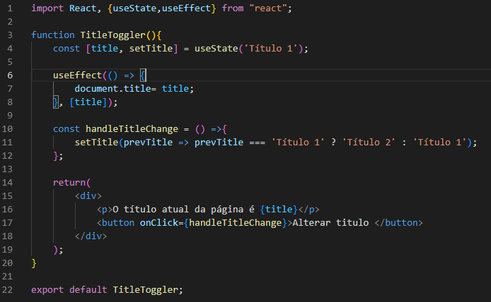
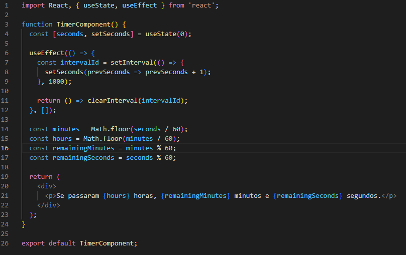

<h3>Exemplo 1 </h3>

<h4>Descrição</h4>

 Neste exemplo faço uso do "useEffect" para alterar o nome do título da página por intermédio do clique do botão.

Primeiro, dentro da função <strong> useEffects</strong> defino  o 'title' para o valor padrão e atual, no caso o 'Título 1', depois o 'setTitle' para definir o valor alterado.

Adiante, na função <strong>handleTitleChange</strong> farei com que 'setTitle' receba um  valor de acordo com um 'if ternário' que altera os valores do título de acordo com  o valor em questão. Se o 'prevTitle' for igual a 'Título 1' o seu valor será alterado para 'Título 2' e vice e versa.

No <strong>'return'</strong> retorno o texto informando qual o título atual, repare que tanto o título da aba quanto o título do conteúdo da página serão alterados após o clique da página.

<h3>Exemplo 2</h3>

<h4>Descrição</h4>

Neste exemplo estou usando a função <strong>setInterval</strong> para somar os segundos e passar esse intervalo ao método <strong>clearInterval</strong>. Com base nele, defino contas que irão exibir os minutos e horas

Por fim em <strong>return</strong> imprimo hora, minuto e segundo de acordo com o acrescimo dos segundos.
